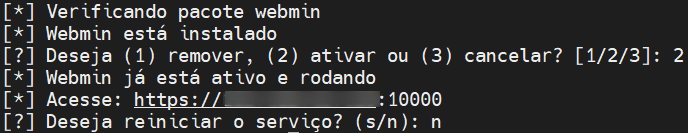
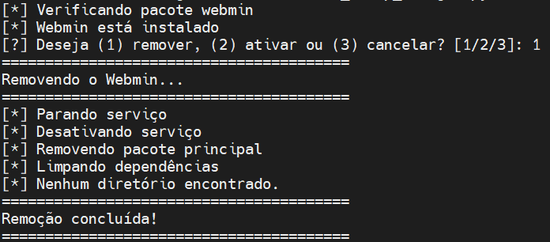

# Webmin Setup Manager


Script Python para instalar ou remover o **Webmin**, ferramenta de administração web para servidores Linux.

## 📋 Funcionalidades

✔️ Detecta automaticamente sua distribuição Linux     
✔️ Instala o Webmin a partir do repositório oficial      
✔️ Remove completamente o Webmin e seus arquivos residuais     
✔️ Configura automaticamente o serviço para iniciar com o sistema    
✔️ Exibe o URL de acesso após instalação     

## 🐧 Distribuições Suportadas

- **Debian**
- **Ubuntu**
- **CentOS**
- **Rocky Linux**
- **Fedora**

### ⚠️ Observação importante para Rocky Linux e Fedora:  
Nestas distribuições, o login no Webmin só pode ser feito utilizando o usuário **root**. Outros usuários do sistema não terão acesso à interface web, mesmo que tenham privilégios sudo.

## ⚙️ Pré-requisitos

- Python 3.x
- Privilégios root/sudo
- Conexão com a internet (para instalar pacotes)
- curl (para baixar o script de instalação)

## 🚀 Como Usar

1. Clone o repositório ou baixe o script:
   ```bash
   git clone https://github.com/jwsallesbr/webmin-setup-manager.git
   cd webmin-setup-manager
   ```
2. Torne o script executável:
   ```bash
   chmod +x webmin_setup_manager.py
   ```
3. Execute como root/sudo:
   ```bash
   sudo ./webmin_setup_manager.py
      ```

## Siga as instruções para:

   ## ⚙️Instalar
   

   ## ✅Ativar
   

   ## ❌Remover
   
   

## 🌐 Após a instalação, o serviço será ativado e a interface poderá ser acessada via web:
```
https://<IP-DO-SERVIDOR>:10000
```
